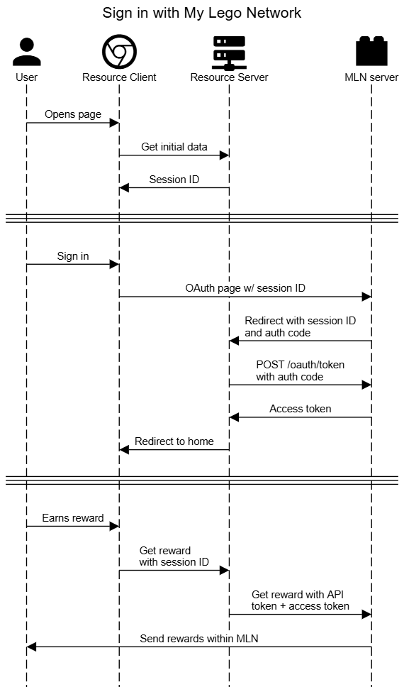

## Sign in with My Lego Network

To facilitate the development of the other mini-games, like Robot Chronicles and Lego City Coast Guard, MLN will host a sort of OAuth-like authentication system that follows the [Authorization Code Grant](https://developer.okta.com/blog/2018/04/10/oauth-authorization-code-grant-type) flow. This document will explain how it works so that future projects can integrate with it.

Note that MLN is not so concerned about staying exactly to spec. Our need to use an OAuth system emerged because we don't want to modify the client's original Flash files more than absolutely necessary, and this turned out to be a great way to do that. We're also in the unique position where we control every mini-game using this system. Extra security and features have been sacrificed for simplicity and maintainability.

### Terms

- The **resource** is the application the user is interacting with, ie, the mini-game.
- The **resource provider** is the developer behind the resource
- The **client** is the user-side application being used to access the resource
- The **resource server** is the server driving the mini-game client

There will be several kinds of variables, so we'll list them out here and explain in-detail later:

- The **API token**, is a secret value that only the resource server and MLN know
  - This is traditionally called the **client secret** but that naming is confusing in this context

- The **client ID** is a non-secret ID that MLN uses to identify a given client
- The **session ID** is a random value generated by the client to identify the user
- The **authorization code** is used by the resource server to ask MLN for an access token
- The **access token** is a random value generated by MLN that identifies the user

### Setup

First, the mini-game and the MLN developers must agree on an API token. This token must not be shared anywhere as it is the only way that MLN can trust the resource server. **This includes not sharing the API token with the client**. MLN will ignore all requests without the correct API token, so this implies that only the resource server will communicate with MLN, and not the client.

To get your API token, provide the following to the MLN developers:

- a **client ID** to identify yourself, usually a UUID
- a user-friendly string name
- a URL to your website's icon
- a URL to your server's login endpoint, called the **redirect URL** (details below)

When a user visits the client, the resource server should generate a **session ID**. This ID should be sent back to the client and used for all further authentication requests. It is essentially the client's "password" for this session. To sign in, the client should redirect the browser to

```text
https://mln.lcdruniverse.org/oauth
```

and pass the following query parameters:

- `client_id`: This is a non-secret ID that identifies the client to MLN to make a nicer login page
- `session_id`: This is a unique value generated by the resource server to identify the user's session with the client. This value will be sent back to the redirect URL as-is

For example:
```text
https://mln.lcdruniverse.org/oauth?client_id=client123&session_id=session123
```

### After login

Once the user signs in, MLN will generate an **access token** which will identify the user to MLN in future requests. Since the token is random and _is not_ related to the user's information, it cannot be used by the client or resource server to independently guess the identity of the user. Still, it should be kept on the resource server and not sent to the client. Trying to redirect will do exactly that. So, we need an intermediate step.

MLN will generate a one-time, short-lived **authorization code**. This code can be sent by the resource server (along with the API token) in exchange for the actual access token. The authorization code cannot be used instead of the access token and so is meaningless if intercepted or used by the client.

MLN will send the client to the redirect URL the client provided, with these query parameters:

- `session_id`: The `session_id` the client provided it
- `auth_code`: The authorization code that MLN generated

For example:
```text
https://coast-guard.lcdruniverse.org/api/login?session_id=session123&auth_code=auth123
```

To get the access token, send a `POST` request to `/oauth/token` with the following:

```js
{
  "api_token": string,
  "auth_code": string,
}
```

 MLN will respond with the following:

```js
{
  "access_token": string,
  "username": string,
}
```

The resource server can now associate the client's original session ID with the access token generated by MLN, and redirect the user back to the original client page they wanted to go to, typically the home page of the mini-game.

### Making future requests

In all future requests, simply include the following two headers:

```text
Authorization: Bearer access_token
Api-Token: api_token
```

Replacing `access_token` and `api_token` as appropriate. These headers will authenticate your client and its association to a user in any request. If these headers are missing or invalid, the server will respond with `401 Unauthorized`. If the access token or API token don't allow your client to perform the requested action, the server will respond with `403 Forbidden`.

## Summary

Now, when the client wants to perform some action in MLN, it sends a request to its resource server with its session ID, as usual. The resource server can check its database to find the associated access token, and send that (along with the API token) to MLN. Once the API token is validated, MLN will lookup the account associated with the access token and perform the requested action. [^1]



This way,

- the client never has direct access to MLN
- the resource server never knows the user's MLN credentials
- MLN can revoke the resource provider's API token at any time

[^1]: The source for this diagram is in `docs/oauth-diagram.txt`. Paste it into https://sequencediagram.org to make changes.